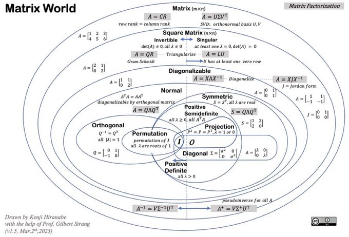
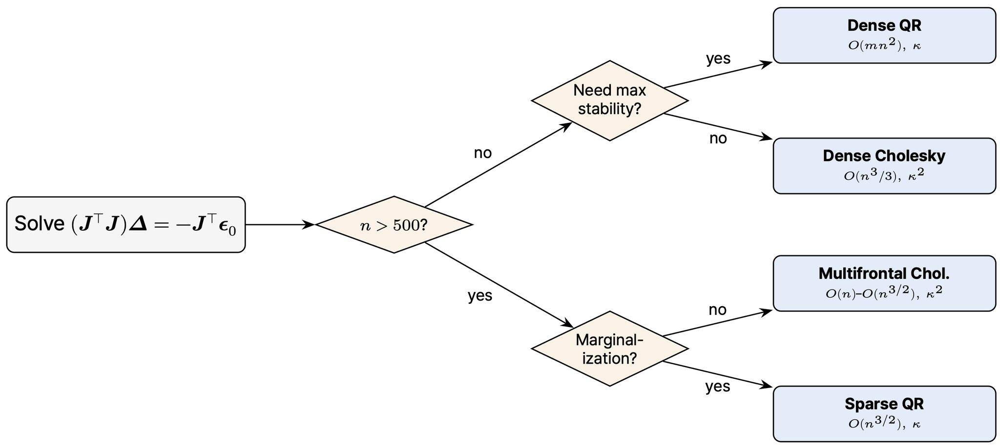

# Chapter 10 Linear Algebra in Robotics

This chapter ties the previous chapters together with concrete robotics
problems and shows **which matrix decomposition each one relies on**:

- [Why decompositions matter](#why-decompositions-matter)
- [Inverse Kinematics — the pseudo-inverse (SVD)](#inverse-kinematics--the-pseudo-inverse-svd)
- [Camera Calibration — DLT (SVD), projection decomposition (QR), Zhang (Cholesky)](#camera-calibration--dlt-svd-projection-decomposition-qr-zhang-cholesky)
- [SLAM — least squares, QR vs Cholesky, and sparsity](#slam--least-squares-qr-vs-cholesky-and-sparsity)
- [Point-Cloud Registration — Kabsch / Umeyama (SVD)](#point-cloud-registration--kabsch--umeyama-svd)
- [PCA & Plane Fitting — eigendecomposition](#pca--plane-fitting--eigendecomposition)
- [Further reading & related projects](#further-reading--related-projects)

The runnable code is in
[`src/3_link_planner_robot.cpp`](src/3_link_planner_robot.cpp),
[`src/camera_calibration_dlt.cpp`](src/camera_calibration_dlt.cpp),
[`src/slam_pose_graph.cpp`](src/slam_pose_graph.cpp),
[`src/point_cloud_registration.cpp`](src/point_cloud_registration.cpp) and
[`src/pca_plane_fit.cpp`](src/pca_plane_fit.cpp).

# Why decompositions matter

Almost every estimation problem in robotics ends up as either solving
`A x = b`, solving a homogeneous system `A x = 0`, or minimizing `||A x - b||²`.
The right matrix factorization is what makes that solve **stable**, **fast**, and
able to **exploit sparsity**. The map below (by Kenji Hiranabe, with Gilbert
Strang) summarizes the factorizations referenced throughout this book — SVD,
QR, LU, Cholesky (`QΛQᵀ` / `LLᵀ`), eigendecomposition, and the pseudo-inverse.



| Robotics problem | Solve type | Decomposition |
| --- | --- | --- |
| Iterative inverse kinematics | minimize / pseudo-inverse | **SVD** |
| Estimating a projection/homography | homogeneous `A x = 0` | **SVD** |
| Splitting `P` into `K` and `R` | `M = K R` | **QR / RQ** |
| Recovering `K` in Zhang calibration | `B = K⁻ᵀK⁻¹`, SPD | **Cholesky** |
| Graph SLAM / bundle adjustment | normal equations `(JᵀJ)Δ = -Jᵀr` | **Cholesky** (sparse, multifrontal) or **QR** |

# Inverse Kinematics — the pseudo-inverse (SVD)

For a manipulator, **forward kinematics** maps joint angles `q` to an
end-effector pose `p = f(q)`. **Inverse kinematics** (IK) asks the reverse: which
`q` reaches a desired pose `p*`? Since `f` is nonlinear, we linearize and iterate.
The Jacobian `J = ∂f/∂q` gives the local linear map `Δp ≈ J Δq`, so each step
solves


where `J⁺` is the **Moore-Penrose pseudo-inverse**. When `J` is square and
invertible this is just `J⁻¹`, but near **singular configurations** `J` loses
rank and `J⁻¹` blows up. Computing `J⁺` from the **SVD** `J = UΣVᵀ`,


lets us handle this gracefully: tiny singular values are truncated (or damped, as
in *damped least squares* / the Levenberg-Marquardt idea from Chapter 9), which
keeps the step bounded. This is exactly the SVD-based pseudo-inverse from
[Chapter 5](5_Dense_Linear_Problems_And_Decompositions.md#4-matrices-decompositions).

The example [`src/3_link_planner_robot.cpp`](src/3_link_planner_robot.cpp) solves
IK for a 3-link planar arm: numerical Jacobian, SVD pseudo-inverse, and a Newton
iteration that converges to the goal pose. A more complete version (with damping,
step clamping, and a null-space / redundancy discussion) is in the companion
project [`planar_3_link_robot`](https://github.com/behnamasadi/planar_3_link_robot).

```cpp
// Moore-Penrose pseudo-inverse via SVD (truncating tiny singular values).
Eigen::MatrixXd pseudoInverse(const Eigen::MatrixXd &m) {
  Eigen::JacobiSVD<Eigen::MatrixXd> svd(m, Eigen::ComputeThinU | Eigen::ComputeThinV);
  double tol = 1e-9 * std::max(m.rows(), m.cols()) * svd.singularValues()(0);
  Eigen::VectorXd inv = svd.singularValues();
  for (int i = 0; i < inv.size(); ++i)
    inv(i) = (inv(i) > tol) ? 1.0 / inv(i) : 0.0;
  return svd.matrixV() * inv.asDiagonal() * svd.matrixU().transpose();
}
```

# Camera Calibration — DLT (SVD), projection decomposition (QR), Zhang (Cholesky)

A pinhole camera projects a world point `X` to a pixel `x` through the `3×4`
**projection matrix** `P`:


with the intrinsic matrix


Three decompositions show up when calibrating a camera:

### 1. Estimating P — Direct Linear Transform (SVD)
Each correspondence `(X, (u,v))` gives two linear equations in the 12 unknowns
of `P`. Stacking `N ≥ 6` correspondences builds a `2N × 12` matrix `A`, and `P`
is the non-trivial solution of the **homogeneous** system `A p = 0`. The solution
is the right-singular vector of the smallest singular value — i.e. the last
column of `V` in the **SVD** `A = UΣVᵀ`:

```cpp
Eigen::JacobiSVD<Eigen::MatrixXd> svd(A, Eigen::ComputeFullV);
Eigen::VectorXd p = svd.matrixV().col(11);   // smallest singular value
```

### 2. Splitting P into K and R — QR (RQ) decomposition
The left `3×3` block of `P` is `M = K R`: an **upper-triangular** matrix times an
**orthogonal** matrix. Recovering `K` and `R` is an RQ decomposition. A clean way
to get it with Eigen's `HouseholderQR` is to note that


is itself a QR factorization (orthogonal × upper-triangular), so:

```cpp
Eigen::HouseholderQR<Eigen::Matrix3d> qr(M.inverse());
Eigen::Matrix3d R = qr.householderQ().transpose();
Eigen::Matrix3d K = qr.matrixQR().triangularView<Eigen::Upper>().solve(
                        Eigen::Matrix3d::Identity());  // K = R_a^{-1}
K /= K(2, 2);  // normalise
```

The example [`src/camera_calibration_dlt.cpp`](src/camera_calibration_dlt.cpp)
builds a known camera, projects points, recovers `P` via SVD-DLT, and factors it
back — recovering `K` to within `~1e-12`:

```
True K:                 Recovered K:
800   0 320             800   0 320
  0 800 240               0 800 240
  0   0   1               0   0   1
```

### 3. Recovering K in Zhang's method — Cholesky
Zhang's planar calibration first estimates a homography `H` per view (again the
last column of `V` from an SVD), then uses the orthonormality of the rotation
columns to set up linear constraints on `B = K⁻ᵀK⁻¹`. `B` is **symmetric positive
definite**, so its **Cholesky** factor `B = LLᵀ` directly yields `K⁻¹` (and hence
`K`). See the full derivation in the
[pinhole camera notebook](https://github.com/behnamasadi/OpenCVProjects).

# SLAM — least squares, QR vs Cholesky, and sparsity

Graph SLAM (and bundle adjustment) estimates robot poses and landmarks by
minimizing the sum of squared measurement residuals. Each Gauss-Newton /
Levenberg-Marquardt iteration linearizes the residuals and solves the **normal
equations**


where `A = JᵀJ` is **symmetric positive (semi-)definite**. Three properties of
this matrix decide the solver:

**Stability — condition number.** A perturbation in the measurements can be
amplified by `κ(A)`. Forming `JᵀJ` **squares the condition number**
(`κ(JᵀJ) = κ(J)²`), so a Cholesky solve on the normal equations loses twice as
many digits as a **QR** solve applied directly to `J`. The SLAM example prints
exactly this:

```
cond(J)      = 5.43713
cond(J^T J)  = 29.5624   (~ cond(J)^2 = 29.5624)
```

So Cholesky on `JᵀJ` is the fast default; QR on `J` is reserved for
ill-conditioned cases (e.g. marginalization of well-constrained variables).

**Sparsity.** Each measurement touches only a few variables, so `J` — and hence
`H = JᵀJ` — is very sparse. For a pose chain, `H` is tridiagonal; a loop closure
adds off-diagonal entries linking the two ends. The example assembles such a
matrix for 5 poses (a prior, four odometry factors, one loop closure):

```
Information matrix H = J^T J (tridiagonal + loop):
 3 -1  0  0 -1
-1  2 -1  0  0
 0 -1  2 -1  0
 0  0 -1  2 -1
-1  0  0 -1  2
```

It is then solved with a **sparse Cholesky** (`SimplicialLDLT`) and, for
comparison, a dense QR — both give the same estimate, with the loop closure
pulling the odometry-only guess `(0,1,2,3,4)` to the least-squares compromise
`(0, 0.98, 1.96, 2.94, 3.92)`.

**Fill-reducing ordering & multifrontal Cholesky.** On large problems the order
in which variables are eliminated determines how much *fill-in* (new non-zeros)
the factorization creates. Orderings such as **AMD / COLAMD** minimize fill, and
**multifrontal Cholesky** turns the sparse factorization into a sequence of small
**dense** block solves (BLAS-3) so the CPU runs near peak. This is why
production libraries optimize maps with thousands of poses in milliseconds:

- **GTSAM** defaults to multifrontal Cholesky (`MULTIFRONTAL_CHOLESKY`), with QR
  available for marginalization (`Marginals::QR`).
- **Ceres Solver** defaults to `SPARSE_NORMAL_CHOLESKY` (via SuiteSparse/CHOLMOD)
  for pose-graph problems, and uses Schur-complement solvers for the
  bipartite camera/landmark structure of bundle adjustment.

| Method | Flops | Sensitivity | Sparsity | Used in |
| --- | --- | --- | --- | --- |
| Dense Cholesky | `O(n³/3)` | `κ²` | none | tiny problems |
| Dense QR | `O(mn²)` | `κ` | none | max stability, small `n` |
| Sparse multifrontal Cholesky + COLAMD | `O(n)`–`O(n^{3/2})` | `κ²` | full | **GTSAM / Ceres default** |
| Sparse QR | `O(n^{3/2})` | `κ` | full | marginalization |

Putting it together, the choice of decomposition for the SLAM normal equations
`(JᵀJ)Δ = -Jᵀε₀` comes down to a few questions — problem size, whether maximum
numerical stability is needed, and whether the step involves marginalization:



*Decision tree credit: Hyungtae Lim, "Matrix Decompositions for SLAM"
([LinkedIn post](https://www.linkedin.com/posts/hyungtae-lim_slam-robotics-gtsam-activity-7457696218987741185-mv0n/)).
The SLAM section of this chapter is based on that lecture material.*

# Point-Cloud Registration — Kabsch / Umeyama (SVD)

Given two sets of corresponding 3D points — for example a scan and a map, or two
overlapping LiDAR sweeps — registration finds the rigid transform `(R, t)` that
best aligns them in the least-squares sense:


The closed-form solution (the **Kabsch** algorithm, generalized by **Umeyama**)
is one of the most elegant uses of the **SVD**: subtract the centroids, form the
`3×3` cross-covariance `H = Σ (pᵢ − p̄)(qᵢ − q̄)ᵀ`, take its SVD `H = UΣVᵀ`, and


The middle `diag(1, 1, det(VUᵀ))` guards against the SVD returning a reflection
instead of a proper rotation. This is the core step inside **ICP** (iterated
closest point) scan-matching.

```cpp
Eigen::Matrix3d H = Pc * Qc.transpose();   // centred cross-covariance
Eigen::JacobiSVD<Eigen::Matrix3d> svd(H, Eigen::ComputeFullU | Eigen::ComputeFullV);
Eigen::Matrix3d D = Eigen::Matrix3d::Identity();
D(2, 2) = (svd.matrixV() * svd.matrixU().transpose()).determinant();
Eigen::Matrix3d R = svd.matrixV() * D * svd.matrixU().transpose();
Eigen::Vector3d t = cQ - R * cP;
```

Eigen also provides this in one call as `Eigen::umeyama(P, Q, with_scaling)`. The
example [`src/point_cloud_registration.cpp`](src/point_cloud_registration.cpp)
recovers a known transform from corresponding points to within `~1e-14`:

```
----- Kabsch (manual SVD) -----
rotation error (deg): 2.1e-14
translation error:    1.3e-15
```

# PCA & Plane Fitting — eigendecomposition

Principal Component Analysis finds the directions of greatest variance in a set
of points as the **eigenvectors of their covariance matrix**. Because the
covariance `C = Σ (xᵢ − x̄)(xᵢ − x̄)ᵀ` is **symmetric positive-semidefinite**, it
has an orthonormal eigenbasis (the `S = QΛQᵀ` branch of the Matrix World map),
computed efficiently with `SelfAdjointEigenSolver`.

A common robotics use is estimating a **surface normal**: the best-fit plane
through a point cloud passes through the centroid, and its normal is the
direction of *least* variance — the eigenvector of the **smallest** eigenvalue.

```cpp
Eigen::Matrix3d cov = centered * centered.transpose();   // symmetric PSD
Eigen::SelfAdjointEigenSolver<Eigen::Matrix3d> es(cov);   // eigenvalues ascending
Eigen::Vector3d normal = es.eigenvectors().col(0);        // smallest eigenvalue
```

For points scattered around the plane `z = 0`, the example
[`src/pca_plane_fit.cpp`](src/pca_plane_fit.cpp) recovers a normal of essentially
`(0, 0, 1)`, with the smallest eigenvalue (the off-plane variance) close to zero:

```
eigenvalues (ascending): 0.00212  7.90  13.82
plane normal:            0.0051  -0.0049  0.99998
```

# Further reading & related projects

This chapter only scratches the surface of linear algebra in robotics. The
following companion repositories develop the neighbouring topics in depth:

- **Lie groups & Lie algebra (`SO(3)`, `SE(3)`)** — the manifold view of
  rotations/poses, `Exp`/`Log`, the adjoint, and on-manifold optimization:
  [robotic_notes — lie_group_lie_algebra.ipynb](https://github.com/behnamasadi/robotic_notes/blob/master/docs/lie_group_lie_algebra.ipynb),
  [lie_groups_se2.ipynb](https://github.com/behnamasadi/robotic_notes/blob/master/docs/lie_groups_se2.ipynb),
  and the [manif SE(3) examples](https://github.com/behnamasadi/robotic_notes/tree/master/src/manif_examples).
- **State estimation — Kalman & Extended Kalman Filter** (covariance
  propagation, the Kalman gain):
  [kalman_filter.ipynb](https://github.com/behnamasadi/robotic_notes/blob/master/docs/kalman_filter.ipynb),
  [extended_kalman_filter.ipynb](https://github.com/behnamasadi/robotic_notes/blob/master/docs/extended_kalman_filter.ipynb).
- **Camera models, projection & multi-view geometry** (the full derivations
  behind the calibration section, plus triangulation and epipolar geometry):
  [OpenCVProjects](https://github.com/behnamasadi/OpenCVProjects).
- **Inverse kinematics** — a fuller treatment with damping, step clamping, and
  null-space/redundancy resolution:
  [planar_3_link_robot](https://github.com/behnamasadi/planar_3_link_robot).

[<< Previous ](9_Numerical_Optimization.md)  [Home](README.md)
