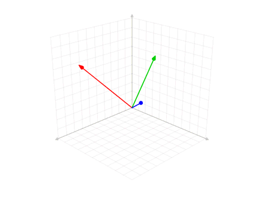
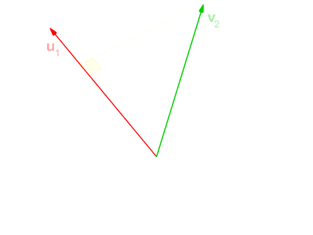
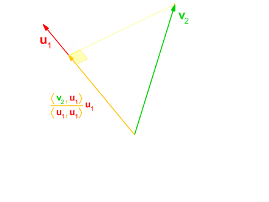
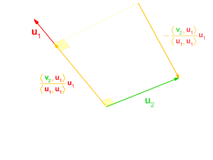
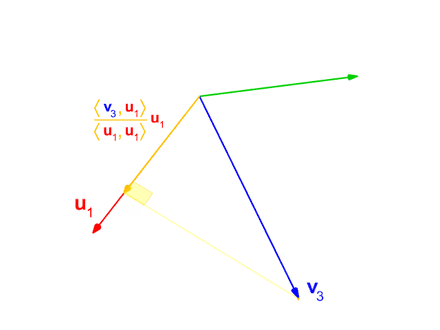
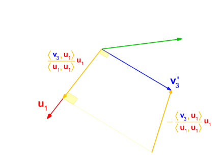
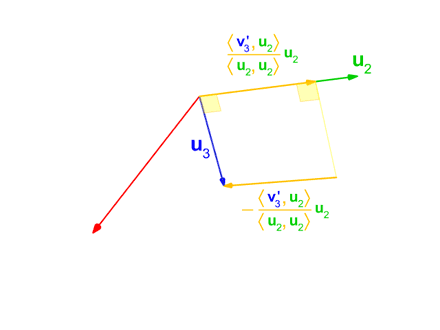

- [Chapter 5 Dense Linear Problems And Decompositions](#chapter-5-dense-linear-problems-and-decompositions)
- [1. Vector Space](#1-vector-space)
  * [1.1. Examples of Vector Spaces](#11-examples-of-vector-spaces)
  * [1.2. Vector Products](#12-vector-products)
    + [1.2.1 Dot Product](#121-dot-product)
    + [1.2.2 The Hadamard product (Schur product)](#122-the-hadamard-product--schur-product-)
    + [1.2.3 Kronecker product](#123-kronecker-product)
- [2. Linear Equation](#2-linear-equation)
  * [2.1. Intuition behind Matrix Multiplication:](#21-intuition-behind-matrix-multiplication-)
  * [2.2. Solution set](#22-solution-set)
  * [2.3. Underdetermined System](#23-underdetermined-system)
  * [2.4. Overdetermined System](#24-overdetermined-system)
  * [2.5. Determined](#25-determined)
  * [2.6. Homogeneous vs Non-homogeneous](#26-homogeneous-vs-non-homogeneous)
- [3. Solving Linear Equation](#3-solving-linear-equation)
  * [3.1. Using the SVD](#31-using-the-svd)
  * [3.2. Complete Orthogonal Decomposition](#32-complete-orthogonal-decomposition)
  * [3.3. Using the QR](#33-using-the-qr)
  * [3.4.  Using Cholesky Decomposition](#34--using-cholesky-decomposition)
  * [3.5. Gaussian Elimination (row reduction)](#35-gaussian-elimination--row-reduction-)
    + [3.5.1. Forward Elimination](#351-forward-elimination)
    + [3.5.2. Forward and Back Substitution](#352-forward-and-back-substitution)
    + [3.5.3. Partial Pivoting and Full Pivoting](#353-partial-pivoting-and-full-pivoting)
    + [3.5.4. Numerical stability in Gaussian Elimination](#354-numerical-stability-in-gaussian-elimination)
    + [3.5.5. Example of The Gaussian Elimination Algorithm](#355-example-of-the-gaussian-elimination-algorithm)
    + [3.5.6.  Row Echelon Form](#356--row-echelon-form)
    + [3.5.7.  Reduced Row Echelon Form](#357--reduced-row-echelon-form)
    + [3.5.8.  Example of Row Echelon](#358--example-of-row-echelon)
    + [3.5.9. Echelon Pivot Column](#359-echelon-pivot-column)
- [4. Matrices Decompositions](#4-matrices-decompositions)
  * [4.1. QR Decomposition](#41-qr-decomposition)
    + [4.1.1. Square Matrix QR Decomposition](#411-square-matrix-qr-decomposition)
    + [4.1.2.  Rectangular Matrix QR Decomposition](#412--rectangular-matrix-qr-decomposition)
  * [4.2. Computing the QR Decomposition](#42-computing-the-qr-decomposition)
  * [4.3. Gram Schmidt Orthogonalization](#43-gram-schmidt-orthogonalization)
  * [4.4. Householder Transformations](#44-householder-transformations)
  * [4.5. QL, RQ and LQ Decompositions](#45-ql--rq-and-lq-decompositions)
  * [4.6. Cholesky Decomposition LL*](#46-cholesky-decomposition-ll-)
  * [4.7. Hermitian Matrix](#47-hermitian-matrix)
  * [4.8. Positive (Semidefinite) Definite Matrix:](#48-positive--semidefinite--definite-matrix-)
  * [4.9. LDL Decomposition](#49-ldl-decomposition)
  * [4.10. Lower Upper (LU) Decomposition](#410-lower-upper--lu--decomposition)
  * [4.11. Lower Diagonal Upper (LDU) decomposition](#411-lower-diagonal-upper--ldu--decomposition)
  * [4.12. Eigen Value and Eigen Vector](#412-eigen-value-and-eigen-vector)
  * [4.13. Calculation of Eigen Value and Eigen Vector](#413-calculation-of-eigen-value-and-eigen-vector)
    + [4.13.1  Example of Calculating Eigen Value and Eigen Vector](#4131--example-of-calculating-eigen-value-and-eigen-vector)
  * [4.14. Eigendecomposition of Matrix](#414-eigendecomposition-of-matrix)
  * [4.15. Singular Value Decomposition](#415-singular-value-decomposition)
    + [4.15.1 Applications of the SVD](#4151-applications-of-the-svd)
      - [4.15.1.1 Pseudoinverse](#41511-pseudoinverse)
      - [4.15.1.2 Solving homogeneous linear equations](#41512-solving-homogeneous-linear-equations)
      - [4.15.1.3  Range, null space and rank](#41513--range--null-space-and-rank)
      - [4.15.1.4 Nearest orthogonal matrix](#41514-nearest-orthogonal-matrix)
- [5. Linear Map](#5-linear-map)
- [6. Span](#6-span)
- [7. Subspace](#7-subspace)
- [7.1. Row Spaces and Column Spaces](#71-row-spaces-and-column-spaces)
- [8. Range of a Matrix](#8-range-of-a-matrix)
  * [8.1. Example of Row Spaces](#81-example-of-row-spaces)
- [9. Basis](#9-basis)
  * [9.1. Example of Computing Basis for Column Space](#91-example-of-computing-basis-for-column-space)
  * [9.2. Example of Computing Basis for Row Space](#92-example-of-computing-basis-for-row-space)
  * [9.3. Changes of basis vectors](#93-changes-of-basis-vectors)
  * [9.4. Covariance and Contravariance of Vectors](#94-covariance-and-contravariance-of-vectors)
  * [9.5. Creating a Basis Set](#95-creating-a-basis-set)
  * [9.6. Change of Basis](#96-change-of-basis)
  * [9.7. Vector Fields](#97-vector-fields)
  * [9.8. Coordinate System](#98-coordinate-system)
    + [9.8.1. Cartesian, Polar, Curvilinear coordinates ,Cylindrical and Spherical Coordinates](#981-cartesian--polar--curvilinear-coordinates--cylindrical-and-spherical-coordinates)
  * [9.9. Coordinate transformations](#99-coordinate-transformations)
  * [9.10. Affine & Curvilinear Transformations](#910-affine---curvilinear-transformations)
- [10. Rank of Matrix](#10-rank-of-matrix)
  * [10.1. Conclusion on Computing Rank](#101-conclusion-on-computing-rank)
- [11. Dimension of the Column Space](#11-dimension-of-the-column-space)
- [12. Null Space (Kernel)](#12-null-space--kernel-)
  * [12.1. Example of Calculating Null Space](#121-example-of-calculating-null-space)
- [13. Nullity](#13-nullity)
- [14. Rank-nullity Theorem](#14-rank-nullity-theorem)
- [15. The Determinant of The Matrix](#15-the-determinant-of-the-matrix)
- [16. Finding The Inverse of The Matrix](#16-finding-the-inverse-of-the-matrix)
- [17. The Fundamental Theorem of Linear Algebra](#17-the-fundamental-theorem-of-linear-algebra)
- [18. Permutation Matrix](#18-permutation-matrix)
- [19. Augmented Matrix](#19-augmented-matrix)


# 1. Vector Space

A vector space is a set  vectors together with two binary operations (vector addition and scalar multiplication) that satisfy the **eight axioms** listed below. In this context, the , and the .


1. Associativity of vector addition: 
2. Commutativity of vector addition: 

3. Identity element of vector addition: There exists an element , called the zero vector, such that for all .

4. Inverse elements of vector addition: For every , there exists an element, called the additive inverse of , such that . 

5. Compatibility of scalar multiplication with field multiplication: 

6. Identity element of scalar multiplication: , where 1 denotes the multiplicative identity in .

7. Distributivity of scalar multiplication with respect to vector addition:   

8. Distributivity of scalar multiplication with respect to field addition: 


## 1.1. Examples of Vector Spaces

1. Trivial or zero vector space
The simplest example of a vector space is the trivial one: , which contains only the zero vector (third axiom in the Vector space)

2. Coordinate space


## 1.2. Vector Products
### 1.2.1 Dot Product

### 1.2.2 The Hadamard product (Schur product)
we use  to denote the element wise product of the two vectors.


### 1.2.3 Kronecker product
If  is an  matrix and  is a  matrix, then the Kronecker product  is the  block matrix:


# 2. Linear Equation

In many applications we have a system of equations

 


<br>
<br>

Which can be written as a single matrix equation:

 
<br>
<br>
Or:
<br>
<br>
 
<br>
<br>

## 2.1. Intuition behind Matrix Multiplication:
We can interpret matrix multiplication as the linear combination of columns:


For instance:


will transform the  into 

 

and will transform  into 


## 2.2. Solution set 

A linear system may behave in any one of three possible ways:

- The system has infinitely many solutions.
- The system has a single unique solution.
- The system has no solution.


The answer of a linear system is determined by the relationship between the number of equations and the number of unknowns.

## 2.3. Underdetermined System
a system with fewer equations than unknowns has infinitely many solutions, but it may have no solution. Such a system is known as an underdetermined system.

## 2.4. Overdetermined System
A system with more equations than unknowns is called as an overdetermined system.

## 2.5. Determined
A system with the same number of equations and unknowns.


Depending on what your matrices looks like, you can choose between various decompositions, and depending on whether you favor speed or accuracy.

## 2.6. Homogeneous vs Non-homogeneous 
A system of linear equations is homogeneous if all of the constant terms are zero.

 


# 3. Solving Linear Equation

## 3.1. Using the SVD

If need to solve the least squares problem,(but are not interested in the SVD), a **faster** alternative method is **CompleteOrthogonalDecomposition**. 


```cpp
#include <iostream>
#include <Eigen/Dense>

Eigen::MatrixXf A = Eigen::MatrixXf::Random(3, 2);
std::cout << "Here is the matrix A:\n" << A << std::endl;
Eigen::VectorXf b = Eigen::VectorXf::Random(3);
std::cout << "Here is the right hand side b:\n" << b << std::endl;
std::cout << "The least-squares solution is:\n"
 << A.bdcSvd(Eigen::ComputeThinU | Eigen::ComputeThinV).solve(b) << std::endl;
```


## 3.2. Complete Orthogonal Decomposition


This class performs a rank-revealing complete orthogonal decomposition of a matrix `A` into matrices `P, Q, T`, and `Z` such that


- `P` is a permutation matrix.
- `Q` and `Z` are unitary matrices and `T` an upper triangular matrix of size rank-by-rank. 
- `A` may be rank deficient.


## 3.3. Using the QR
The `solve()` method in QR decomposition classes also computes the least squares solution. There are three QR decomposition classes: 
1. `HouseholderQR` (no pivoting, **fast** but **unstable** if your matrix is not rull rank), 
2. `ColPivHouseholderQR` (column pivoting, thus a bit **slower** but **more stable**) 
3. `FullPivHouseholderQR` (full pivoting, so **slowest** and slightly **more stable** than `ColPivHouseholderQR`).

```cpp
Eigen::MatrixXf A = Eigen::MatrixXf::Random(3, 2);
Eigen::VectorXf b = Eigen::VectorXf::Random(3);
cout << "The solution using the QR decomposition is:\n"
     << A.colPivHouseholderQr().solve(b) << endl;
```

## 3.4.  Using Cholesky Decomposition

solution of  is equivalent to solving the normal equation 

This method is usually the fastest, especially when A is **tall and skinny**. However, if the matrix A is even mildly ill-conditioned, this is not a good method, because the condition number of  is the square of the condition number of A. This means that you lose roughly twice as many digits of accuracy using the normal equation, compared to the more stable methods mentioned above.


```cpp
Eigen::MatrixXf A = Eigen::MatrixXf::Random(3, 2);
Eigen::VectorXf b = Eigen::VectorXf::Random(3);
std::cout << "The solution using normal equations is:\n" << (A.transpose() * A).ldlt().solve(A.transpose() * b) << std::endl;
```

Refs: [1](https://eigen.tuxfamily.org/dox-devel/group__LeastSquares.html)

## 3.5. Gaussian Elimination (row reduction)
Gaussian Elimination (row reduction) can be used to solve the systems of linear equations. 
It consists of a sequence of elementary row operations to modify the matrix until the lower left-hand corner of the matrix is filled with zeros and turn into row echelon form . 


There are three types of elementary row operations:

1. Swapping two rows,
2. Multiplying a row by a nonzero number,
3. Adding a multiple of one row to another row.


This method can also be used to compute 
- The rank of a matrix.
- The determinant of a square matrix.
- Inverse of an invertible matrix.

### 3.5.1. Forward Elimination
### 3.5.2. Forward and Back Substitution

A matrix equation in the form  or  is very easy to solve.


In lower triangular you first compute  then substitutes that forward into the next equation to solve for  and repeats through to 

This is called **Forward Substitution**

In an upper triangular matrix, one works backwards, first computing 
 then substituting that back into the previous equation to solve for  and repeating through . This is called **Back Substitution**.


### 3.5.3. Partial Pivoting and Full Pivoting
- Partial pivoting is about changing the rows of the matrix, effectively changing the order of the equations, for the case when  the pivot is zero and and also for the case when the pivot is a very small number so might lose accuracy due to the round off error.
 
- Full pivoting means both row and column interchanges, for instance we find the biggest element in the matrix and we swap rows and columns untill it becomes the most left-top element for pivoting. This is usually doen for more numerical stability. 

Refs: [1](https://www.youtube.com/watch?v=S5dL9xOj0lU&list=PLkZjai-2Jcxn35XnijUtqqEg0Wi5Sn8ab&index=25)
### 3.5.4. Numerical stability in Gaussian Elimination
In Gaussian elimination it is generally desirable to choose a pivot element with large absolute value. For instance in the following matrix:


The solution is `x1 = 10.00` and `x2 = 1.000`, but when the elimination algorithm   performed with four-digit arithmetic, the small value of   yields the approximation of `x1 ≈ 9873.3` and `x2 ≈ 4`.

In this case we should interchange the two rows so that  is in the pivot position 


### 3.5.5. Example of The Gaussian Elimination Algorithm

Suppose the following system of linear equations:


Augmented matrix:


<br/>
<br/>


<br/>
<br/>


<br/>
<br/>


<br/>
<br/>


<br/>
<br/>


<br/>
<br/>


<br/>
<br/>


<br/>
<br/>


<br/>
<br/>


<br/>
<br/>


<br/>
<br/>

###  3.5.6.  Row Echelon Form

A matrix is in echelon form after a Gaussian elimination process and:

- All rows consisting of only zeroes are at the bottom.
- The left-most nonzero entry (leading entry also called the **pivot**) of every nonzero row is to the right of the leading entry of every row above. 


The following matrix is in row echelon form, but not in reduced row echelon 


The matrix: 


is echelon, but not triangular (because not square). 

The matrix: 


is triangular, but not echelon because the leading entry 4 is not to the right of the leading entry 2.
For non-singular square matrices, "row echelon" and "upper triangular" are equivalent.

###  3.5.7.  Reduced Row Echelon Form
A matrix is reduced row echelon form if it is in row echelon form and:
- The leading entry in each nonzero row is a 1 (called a leading 1).
- Each column containing a leading 1 has zeros in all its other entries.


This matrix is in reduced row echelon form, which shows that the left part of the matrix is not always an identity matrix:


echelon form is not **unique**, but every matrix has a unique **reduced row echelon form**.


###  3.5.8.  Example of Row Echelon


### 3.5.9. Echelon Pivot Column
If a matrix is in row-echelon form, then the first nonzero entry of each row is called a pivot, and the columns in which pivots appear are called pivot columns.


# 4. Matrices Decompositions
Depending on what your matrices looks like, you can choose between various decompositions, and depending on whether you favor speed or accuracy.

##  4.1. QR Decomposition
### 4.1.1. Square Matrix QR Decomposition
If   is a real square matrix, then it may be decomposed as:

 

<br>
<br>


Where where  is an orthogonal matrix, 
meaning: 

 and  is an upper triangular matrix.
Furthermore, if  is invertible, then the factorization is unique if we require the diagonal elements of   to be positive.


For complex square matrices,   is a unitary matrix, meaning 


### 4.1.2.  Rectangular Matrix QR Decomposition
If  where  we can factor it into  unitary matrix  and  an  upper triangular matrix . Since after  row, in  all elements are entirely zeroes, we can rewrite our equation in the following form:


where 
 is an  upper triangular matrix and  is   with orthogonal columns


## 4.2. Computing the QR Decomposition
## 4.3. Gram Schmidt Orthogonalization 
Gram–Schmidt process is a method for orthonormalizing a set of vectors. In this process you make every column perpendicular to it's previous columns. Lets first define the **projection operator** by


where  denotes the inner product.


Explanation, Let's put 


So we already know:


which mean the magnitude of projection vector is:


and the direction is in the direction , so you have to make a unit vector of  (by dividing it by its size) and then multiply by the magnitude of the projection vector that we just calculated. 

so putting everything together:


<br/>
<br/>


<br/>
<br/>


will give us:


<br/>
<br/>


Now lets imagine we have the following vectors,  




The Gram–Schmidt process has the followings steps:



<br>


<br>


<br>


<br>


 <br>


<br>


<br>
<br>


<br>
<br>



<br>


<br>
<br>


Due to rounding errors, the vectors  are often not quite orthogonal, therefore, it is said that the (classical) Gram–Schmidt process is numerically unstable. This can be stabilized by a small modification, where 
Instead of computing the vector  as:


<br>
<br>
We do the following:
<br>
<br>



<br>
<br>

<br>
<br>



<br>
<br>


We can now express the  s over our newly computed orthonormal basis:


<br>
<br>


This can be written in matrix form:
<br>
<br>


<br>
<br>


<br>
<br>


## 4.4. Householder Transformations


Refs: [1](https://www.youtube.com/watch?v=pOiOH3yESPM)

## 4.5. QL, RQ and LQ Decompositions
We can define , , and  decompositions, with  being a lower triangular matrix.

## 4.6. Cholesky Decomposition LL*

Cholesky decomposition is a decomposition of a Hermitian, positive-definite matrix into the product of a lower triangular matrix and its conjugate transpose


## 4.7. Hermitian Matrix
Hermitian Matrix means a matrix that its transpose is its conjugate:


## 4.8. Positive (Semidefinite) Definite Matrix:
Matrix  is said to be positive definite if for every the nonzero real column vector  the scalar 

is positive.


Example:


<br/>
<br/>


Cholesky decomposition of a **Hermitian positive-definite** matrix A is:
  
  


  
-   is a lower triangular matrix with real and positive diagonal entries.
-  is the conjugate transpose of   


## 4.9. LDL Decomposition
A closely related variant of the classical Cholesky decomposition is the LDL decomposition:


where  is a lower unit triangular (unitriangular) matrix, and  is a diagonal matrix


Example:


<br/>
<br/>


<br/>
<br/>


<br/>
<br/>


Refs: [1](https://www.youtube.com/watch?v=2uKoKKLgZ4c)

## 4.10. Lower Upper (LU) Decomposition

Lower-upper (LU) decomposition factors a matrix as the product of a lower triangular matrix and an upper triangular matrix
LU decomposition can be viewed as the matrix form of Gaussian elimination.

In the lower triangular matrix all elements above the diagonal are zero, in the upper triangular matrix, all the elements below the diagonal are zero.


## 4.11. Lower Diagonal Upper (LDU) decomposition
A Lower-diagonal-upper (LDU) decomposition is a decomposition of the form


where  is a diagonal matrix, and   and   are unitriangular matrices, meaning that all the entries on the diagonals of   and   are one.


## 4.12. Eigen Value and Eigen Vector


An eigenvalue and eigenvector are a scalar value and a non-zero vector that, when a linear transformation is applied to it, changes only by a scalar factor. 
More formally, if  is a linear transformation and  is a vector, then


## 4.13. Calculation of Eigen Value and Eigen Vector

where  is a scalar (the eigenvalue) and  is the eigenvector. 


<br/>


<br/>


### 4.13.1  Example of Calculating Eigen Value and Eigen Vector


<br/>
<br/>


<br/>
<br/>


<br/>
<br/>

Eigenvalues are −1, 2 and 8.


## 4.14. Eigendecomposition of Matrix

## 4.15. Singular Value Decomposition
Singular value decomposition (SVD) is a factorization of a real or (complex matrix) which generalizes the eigendecomposition of a square matrix. 


1.  is complex unitary matrix


2.  rectangular diagonal matrix with non-negative real numbers on the diagonal.  
3.  The diagonal entries  of   are **uniquely** determined by `M` and are known as the singular values of M. 

4.   is the conjugate transpose of `V`. Such decomposition always exists for any complex matrix. 

5. If `M`is real, then `U` and `V` can be guaranteed to be real orthogonal matrices.


6. The columns of `U`  and the columns of `V`  are form two sets of orthonormal bases and the singular value decomposition can be written as:

<br/>
  

<br/> 
 
 


7. The SVD is **not** unique.


###  4.15.1 Applications of the SVD
#### 4.15.1.1 Pseudoinverse


 is formed by replacing every non-zero diagonal entry by its reciprocal   and transposing the resulting matrix. 


<br/>


#### 4.15.1.2 Solving homogeneous linear equations


for any matrix:

<br/>


<br/>
<br/>

therefore:

<br/>
<br/>


Refs: [1](https://math.stackexchange.com/questions/1768181/svd-and-homogeneous-equation)


####  4.15.1.3  Range, null space and rank


The last columns do serve as a basis for the null space:


rank\}" />


Refs: [1](https://math.stackexchange.com/questions/1771013/how-is-the-null-space-related-to-singular-value-decomposition)

####  4.15.1.4 Nearest orthogonal matrix


# 5. Linear Map
Let   and   be vector spaces over the same field  . A function   is said to be a linear map if for any two vectors
   and any scalar 
    the following two conditions are satisfied:

1. Additivity


2. Operation of scalar multiplication


# 6. Span

The linear span of a set  of 
vectors for a vector space is as the set of all finite linear combinations of the vectors in  

Example: 
1. The span of 


is:


2. The real vector space   has {(−1, 0, 0), (0, 1, 0), (0, 0, 1)} as a spanning set as a spanning set.


The set {(1, 0, 0), (0, 1, 0), (1, 1, 0)} is **not** a spanning set of 
, since its span is the space of all vectors in   whose last component is zero.

# 7. Subspace

A vector subspace is a subset of a vector space that satisfies certain properties, such that:
1. The set includes the zero vector.

2. The set is closed under scalar multiplication.

3. The set is closed under addition.


In other words, if two vectors are in the subspace, their sum and scalar multiples must also be in the subspace. It is also non-empty and closed under linear combinations.


Examples of subspace:


# 7.1. Row Spaces and Column Spaces

The column space of a matrix  is the span (set of all possible linear combinations) of its column vectors.

# 8. Range of a Matrix
The range of a matrix, also known as the column space of a matrix, is the span of the columns of the matrix. In other words, it is the set of all possible linear combinations of the columns of the matrix.

```cpp
template <typename T>
Eigen::Matrix<T, Eigen::Dynamic, Eigen::Dynamic>
CompleteOrthogonalDecomposition(const Eigen::Matrix<T, Eigen::Dynamic, Eigen::Dynamic> &M) {
  Eigen::CompleteOrthogonalDecomposition<
      Eigen::Matrix<T, Eigen::Dynamic, Eigen::Dynamic>>
      cod(M);
  const Eigen::Matrix<T, Eigen::Dynamic, Eigen::Dynamic> Q =
      cod.householderQ();
  return Q.leftCols(cod.rank());
}
```


Refs: [1](https://math.stackexchange.com/questions/2037602/what-is-range-of-a-matrix)

## 8.1. Example of Row Spaces


The rows are:

- 

- 

- 

- 

Consequently, the row space of  is the subspace of  spanned by  . Since these four row vectors are linearly independent, the row space is 4-dimensional.

<br/>

# 9. Basis


In linear algebra, a basis is a set of linearly independent vectors that can be used to span a vector (sub)space.  The dimension of a vector space is the number of vectors in a basis for the space.
To find the column basis in matrix you have to find the pivot column as they are linearly independent, so first write the matrix in the row echelon form and then pick the pivot columns.

Number of basis for a space is the dimension of that space. The dimension of the column space is the rank of the matrix.

## 9.1. Example of Computing Basis for Column Space

We write the matrix in the row echelon form, and then pick the pivot columns. For example, the matrix A given by


following elementary row operations:


There are two non-zero rows in the final matrix and therefore the rank of matrix is 2 and column 1 and 2 are basis for the column space:


 , 


##  9.2. Example of Computing Basis for Row Space
Let say we have the following matrix:


By writing it into row echelon form:


Now we pick the non-zero rows, so the basis for row space of our matrix is:


##  9.3. Changes of basis vectors
Let say our first basis vector set is:


 

and our second basis vector set is:


In fact these are the position of the second basis vectors in our first basis set.
If a vector is described as 


in our second basis we can find it in the first basis as:

 

or matrix multiplication where the columns of the matrix are second basis vectors:


##  9.4. Covariance and Contravariance of Vectors


Two ways to describe a vector in basis vectors:

1) Parallel Projection Counting how many unit vectors we should add to get our vector. In our example:


2)perpendicular projection Dot product our vector with basis vector:


If we double the size of the basis vectors, our new basis is:


This will turn our old vector:


into:


Because these two quantities change "contrary" to one other, they are are refereed as "contra-variant" component of the vector.

If we use the second approach to represent our vector, the associated dot product will also double. 


Ref: [1](https://mathinsight.org/taylors_theorem_multivariable_introduction), [2](http://www.math.toronto.edu/courses/mat237y1/20199/notes/Chapter2/S2.6.html), [3](https://www.youtube.com/watch?v=vvE5w3iOtGs), [4](http://jccc-mpg.wikidot.com/vector-projection), [5](https://www.youtube.com/watch?v=P2LTAUO1TdA&list=PLZHQObOWTQDPD3MizzM2xVFitgF8hE_ab&index=13)

## 9.5. Creating a Basis Set


## 9.6. Change of Basis

The concept of a change of basis in linear algebra involves transitioning from one set of basis vectors to another, effectively redefining how vectors in a space are represented. This is crucial in many areas of mathematics and physics, as it allows for the representation of vectors and linear transformations in the most convenient basis for a given problem.

### The Equation for Change of Basis

Given a vector space  and two bases for this space, say  and , a vector  in  can be represented in terms of both bases. If  is the change of basis matrix from  to , then the coordinates of  in the basis  can be found by multiplying  with the coordinates of  in the basis . Mathematically, this is expressed as:


Where:
-  is the representation (coordinates) of  in basis ,
-  is the representation (coordinates) of  in basis ,
-  is the matrix whose columns are the coordinates of the basis vectors of  expressed in the basis .

### Example of Change of Basis

Let's consider a simple 2D example where we change the basis from the standard basis  to a new basis , where  and .

**Objective**: Find the coordinates of a vector  in the new basis .

1. **Express the new basis vectors in terms of the standard basis**:
   -  corresponds to ,
   -  corresponds to .

2. **Construct the change of basis matrix **:
   - , where the columns are  and  expressed in the standard basis.

3. **Calculate the coordinates of  in the new basis ** by solving , where  is the inverse of the change of basis matrix , and  is the representation of  in the standard basis.

Let's calculate the coordinates of  in the new basis .

The coordinates of the vector  in the new basis , where  and , are . This means that in the basis , the vector  can be represented as .


## 9.7. Vector Fields
Ref: [1](https://tutorial.math.lamar.edu/classes/calciii/VectorFields.aspx)

## 9.8. Coordinate System
### 9.8.1. Cartesian, Polar, Curvilinear coordinates ,Cylindrical and Spherical Coordinates

Ref: [1](https://www.skillsyouneed.com/num/polar-cylindrical-spherical-coordinates.html)

## 9.9. Coordinate transformations
Refs [1](https://en.wikipedia.org/wiki/List_of_common_coordinate_transformations)

## 9.10. Affine & Curvilinear Transformations


# 10. Rank of Matrix

Let  be an m-by-n matrix. Then

-  = number of pivots in any echelon form of 

-  = the maximum number of linearly independent **rows** or **columns** of 

- 

## 10.1. Conclusion on Computing Rank
In practice, due to floating point error on computers,  Gaussian elimination (LU decomposition) can be unreliable, therefore rank-revealing decomposition such as RRQR factorization (rank-revealing QR which is QR decomposition with pivoting) should be used. The singular value decomposition (SVD) can be used, but it is not an efficient method to do so.


# 11. Dimension of the Column Space

The dimension of the column space or row space is called the rank of the matrix, and is the maximum number of linearly independent columns


# 12. Null Space (Kernel)


If  is a matrix, the null-space (The kernel of  ) consists of all the linear combinations of vectors that get mapped to the zero vector when multiplied by , in other words it is, the set of all vectors  such that . It's good to think of the matrix as a linear transformation; if you let 
, then the null-space is again the set of all vectors that are sent to the zero vector by . Think of this as the set of vectors that lose their identity as h is applied to them.
Note that the null-space is equivalently the set of solutions to the homogeneous equation 


Writing   , then the null-space is the set of all vectors that are sent to the zero (lose their identity) as  is applied to them.


## Most Common Way to Find the Null Space
1. Row Reduction (Gaussian Elimination)
2. Singular Value Decomposition (SVD)
3. Eigenvalue Decomposition: For square matrices, the null space is closely related to the eigenvectors corresponding to the eigenvalue of zero. . The columns of   corresponding to zero singular values in   form an orthonormal basis for the null space of 


4. QR Decomposition

## 12.1. Example of Calculating Null Space

Example 1:

<br/>

Lets say we have the following matrix:


By performing row operations we will get the row echelon form:


<br/>
<br/>


<br/>
<br/>


<br/>
<br/>


These two column are basis of our kernel.

With Eigen, you can get a basis of the null space using `Eigen::FullPivLU::kernel()` method:

```cpp
Eigen::MatrixXd A(3,4);
A<<1 ,1 ,2, 1 ,
    3,1,4,4,
    4,-4,0,8;


Eigen::FullPivLU<Eigen::MatrixXd> lu(A);
Eigen::MatrixXd A_null_space = lu.kernel();
```
Since `FullPivLU` is [expensive](http://eigen.tuxfamily.org/dox/group__DenseDecompositionBenchmark.html), a better alternate is 
to use `CompleteOrthogonalDecomposition.`

```cpp
CompleteOrthogonalDecomposition<Matrix<double, Dynamic, Dynamic> > cod;
cod.compute(A);
std::cout << "rank : " << cod.rank() << "\n";
// Find URV^T
MatrixXd V = cod.matrixZ().transpose();
MatrixXd Null_space = V.block(0, cod.rank(),V.rows(), V.cols() - cod.rank());
MatrixXd P = cod.colsPermutation();
Null_space = P * Null_space; // Unpermute the columns
// The Null space:
std::cout << "The null space: \n" << Null_space << "\n" ;
// Check that it is the null-space:
std::cout << "A * Null_space = \n" << A * Null_space  << '\n';
```

<br/>
Example 2
<br/>

Refs: [1](http://immersivemath.com/ila/ch08_rank/ch08.html#sec_rank_null_space)

# 13. Nullity
The dimension of the kernel of A is called the **nullity** of A


The kernel of L is the vector space of all elements v of V such that 
 , where 0 denotes the zero vector in W.


We can represent the linear map as matrix multiplication  . The kernel of the linear map L is the set of solutions   . 


This means to find the kernel of A is we need to solve the above homogeneous equations.


Refs: [1](https://math.unm.edu/~loring/links/linear_s06/nullity.pdf)

# 14. Rank-nullity Theorem

Let   be a linear transformation. Then


Nullity is the complement to the rank of a matrix. 


# 15. The Determinant of The Matrix
Then the determinant of A is the product of the elements of the diagonal of B:


# 15.1 Interpretation of matrix determinant

The determinant of a matrix has several important interpretations and implications, especially in the context of linear algebra and its applications across various fields such as mathematics, physics, and engineering. Here are the key interpretations:

1. **Geometric Interpretation**:
   - The determinant of a matrix represents the scaling factor of the transformation defined by the matrix. In two dimensions, it tells you how much the area of a shape will change after it's transformed by the matrix. In three dimensions, it tells you how much the volume of a solid will change.
   - When the determinant is **zero**, it means that the transformation squashes the shape into a lower-dimensional space, effectively reducing its volume (or area in 2D) to zero. This implies that the matrix is singular, meaning it does not have an inverse, and the vectors that the matrix is transforming are linearly dependent.
   - A **large determinant** (whether positive or negative) indicates that the shape is scaled up by a large factor in terms of area or volume. A positive determinant means the orientation is preserved (e.g., right-handed to right-handed coordinate system), while a negative determinant indicates a change in orientation (e.g., right-handed to left-handed coordinate system).

2. **Algebraic Interpretation**:
   - The determinant provides a criterion for the invertibility of a matrix. A non-zero determinant means the matrix is invertible (non-singular), while a zero determinant means it is not invertible (singular).
   - The value of the determinant can also be seen in the context of solving systems of linear equations. A zero determinant implies that the system of equations does not have a unique solution, either having no solution or infinitely many solutions.

Let's go through some numerical examples to illustrate these points:

### Example 1: Zero Determinant
Consider the matrix


This matrix represents a linear transformation that maps 2D vectors in a way that makes them linearly dependent. The determinant of \(A\) would be \(0\), indicating that it collapses the plane into a line or point, depending on the vectors it's transforming.

### Example 2: Non-Zero Determinant
Consider the matrix


The determinant of  would be \(6\), indicating that this transformation scales areas by a factor of . It is invertible, and the transformation preserves the orientation of shapes.

Let's calculate these determinants to illustrate the points made.

As calculated:

- The determinant of matrix  is , which confirms our interpretation that it cannot invert the transformation it represents. This means the matrix maps all input vectors into a lower-dimensional space (in this case, a line or a point), indicating that the vectors are linearly dependent.

- The determinant of matrix  is , indicating that the transformation it represents scales areas by a factor of . This matrix is invertible, and the transformation it represents preserves the orientation of shapes.

Refs: [1](https://www.youtube.com/watch?v=Ip3X9LOh2dk)


# 16. Finding The Inverse of The Matrix
First, add the n × n identity matrix is augmented to the right of A such that we get the following

 Now during the elementary row operations, apply the same operations on the identity matrix on the right hand side. At the end teh matrix n the right hand side is the inverse of A.


# 17. The Fundamental Theorem of Linear Algebra


# 18. Permutation Matrix

A permutation matrix is a square binary matrix that has exactly one entry of `1` in each row and each column and `0`s elsewhere.


# 19. Augmented Matrix


[<< Previous ](4_Advanced_Eigen_Operations.md)  [Home](README.md)  [ Next >>](6_Sparse_Matrices.md)
