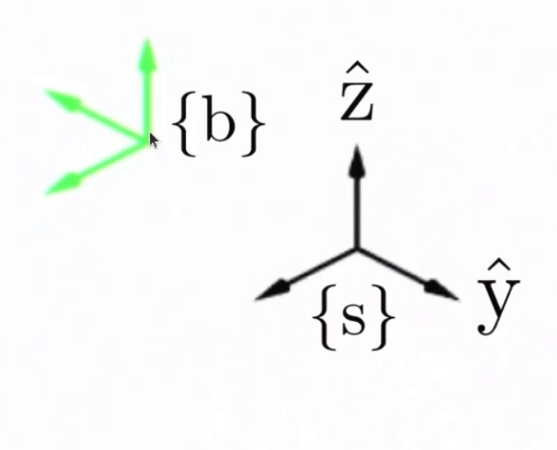
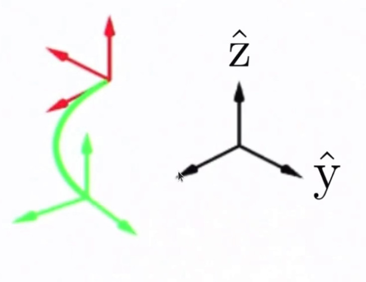
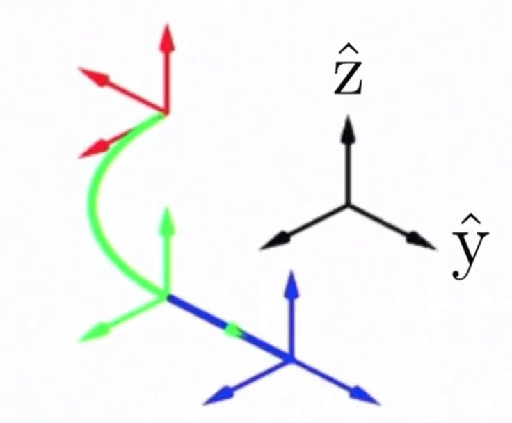
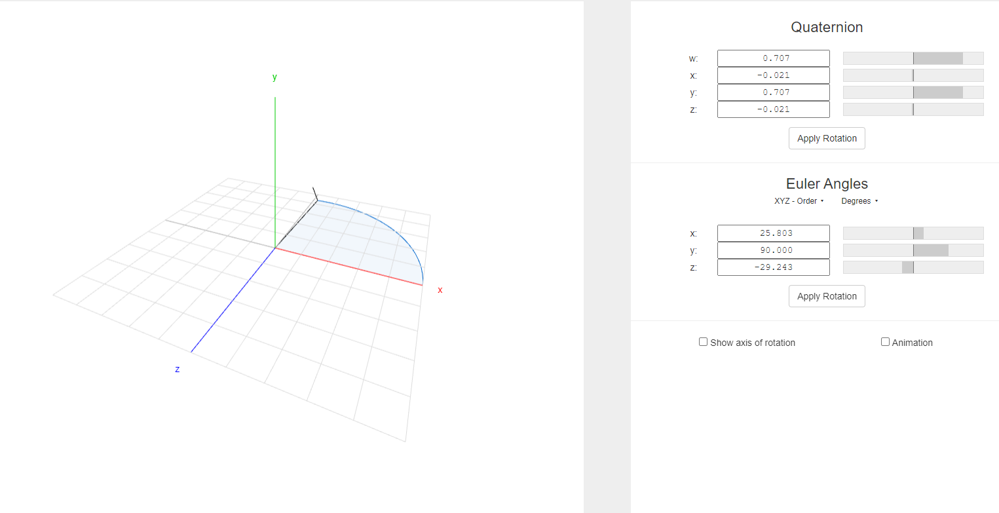
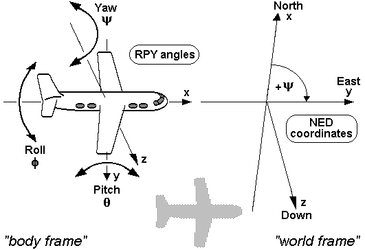
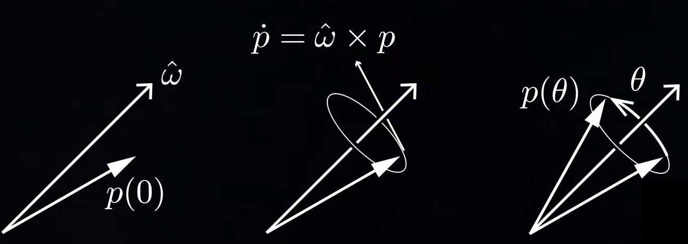
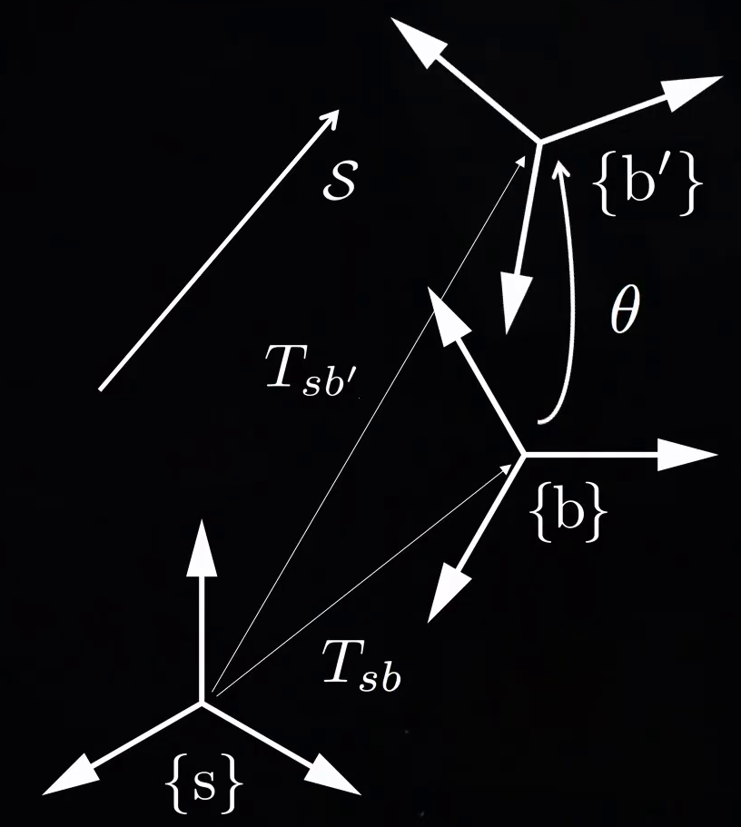

# Chapter 7 Geometry Transformation


# 1. Euler Angles
## 1.1. Introduction
The Euler angles are three angles to describe the orientation of a rigid body with respect to a fixed coordinate system.


The rotations may be about the axes `XYZ` of the original coordinate system, which is assumed to remain motionless (extrinsic), or rotations about the axes of the rotating coordinate system `XYZ` (intrinsic), solidary with the moving body, which changes its orientation with respect to the extrinsic frame after each elemental rotation.


## 1.2. Roll, Pitch, and Yaw

Euler angles are typically denoted as:
-  represents a rotation around the x axis.
-  represents a rotation around the y axis,
-  represents a rotation around the z axis,


## 1.3. Proper Euler angles and Tait-Bryan angles

There exist twelve possible sequences of rotation axes, which can be divided into two categories: 
1. **Proper Euler angles**, where one axis of rotation is repeated (x-z-x, x-y-x, y-x-y, y-z-y, z-y-z, z-x-z), 
2. **Tait-Bryan angles**, which rotate around all axes (x-z-y, x-y-z, y-x-z, y-z-x, z-y-x, z-x-y).


Sometimes, both kinds of sequences are called "Euler angles". In that case, the sequences of the first group are called **proper** or **classic Euler** angles.


There are six possibilities of choosing the rotation axes for Tait–Bryan angles. The six possible sequences are:

- x-y′-z″ (intrinsic rotations) or z-y-x (extrinsic rotations)
- y-z′-x″ (intrinsic rotations) or x-z-y (extrinsic rotations)
- z-x′-y″ (intrinsic rotations) or y-x-z (extrinsic rotations)
- x-z′-y″ (intrinsic rotations) or y-z-x (extrinsic rotations)
- z-y′-x″ (intrinsic rotations) or x-y-z (extrinsic rotations): the intrinsic rotations are known as: yaw, pitch and roll
- y-x′-z″ (intrinsic rotations) or z-x-y (extrinsic rotations)

## 1.4. Rotation matrix


<br/>
<br/>


<br/>
<br/>


<br/>
<br/>


<br/>
<br/>

It is important to note that  performs the roll first, then the pitch, and finally the yaw. 

<br/>
<br/>

## 1.5. Determining Yaw, Pitch, And Roll From a Rotation Matrix
<br/>
<br/>


<br/>
<br/>

<br/>
<br/>


<br/>
<br/>


and


<br/>
<br/>
There is a choice of four quadrants for the inverse tangent functions. Each quadrant should be chosen by using
the signs of the numerator and denominator of the argument. The <b>numerator</b> sign selects whether the direction will be above or below the <b> x-axis </b>, and the <b>denominator </b> selects whether the direction will be to the left or right of the <b>y-axis </b>. the function <b>atan2</b>
can calculate this for us:

- 

- 

- 

Note that this method assumes  and .


## 1.6. Signs and ranges

- for  and , the range is defined modulo radians. For instance, a valid range could be .
- for , the range covers  radians (but can't be said to be modulo ). For example, it could be  or .


## 1.7. Tait–Bryan Angles
<br/>
<br/>


<br/>
<br/>


<br/>
<br/>

## 1.8. Equivalent Proper Euler Angles

<br/>
<br/>


<br/>
<br/>


## 1.9. Oder of Rotation and Translation in Transformation

to apply a transformation, first we apply the rotation around the axis of the frame the we pre-multiplied and then we translate again on the axis of the frame that we pre-multiplied


<br/>
<br/>


<br/>
<br/>


<br/>
<br/>

<br/>
<br/>

<br/>
<br/>


# 1.10. Gimbal Lock 
The angles  are uniquely determined except for the singular case. If 

1. 
<br/>
<br/>


This will result in:

- 

- 


<video width="640" height="480" controls>
  <source src="vidoes/gimbal_locl_beta_pi_2.mp4" type="video/mp4">
</video>


2. 


This will result in:

- 

- 

This means that there are infinitely many sets of (roll,yaw) angles for a given rotation matrix at with 


Visit the [link](https://compsci290-s2016.github.io/CoursePage/Materials/EulerAnglesViz/) for interactive Gimbal visualization.


Absolutely, let's illustrate the gimbal lock issue using a numerical example and then explain how the problem manifests in the Euler angle representation but not with quaternions.

### Numerical Example:

Consider a 3D object that we wish to rotate using the roll-pitch-yaw sequence (often used in aerospace). For the sake of simplicity, let's work with degrees:

1. **Initial orientation**: No rotation applied. Euler angles are (roll, pitch, yaw) = (0°, 0°, 0°).
   
2. **Rotation**: We apply a pitch of +90°. Now, our Euler angles are (0°, 90°, 0°).

At this point, the object's 'nose' is pointing straight up. Here's the problem:

If we now try to apply a roll of, say, +45°, the actual effect in 3D space will be identical to applying a yaw of +45°. We cannot distinguish between roll and yaw anymore; they have become degenerate. This is gimbal lock. 

### Numerical Values:

**Euler Angles**:
After the `+90°` pitch, our Euler angles become:
Roll: `0°` (or `+45°` if we attempt a roll after pitching)
Pitch: `90°`
Yaw: `0°` (or `+45°` if we attempt a yaw after pitching)

This is problematic because after the pitch of +90°, the roll and yaw rotations are indistinguishable in effect.


**Quaternion Representation**:
The rotation for a +90° pitch around the Y-axis can be represented as:
   
=   

=   
 


Now, if we wanted to apply a roll of +45° after this pitch using quaternions, we would multiply the above quaternion by the quaternion representation of a +45° roll around the X-axis, resulting in a distinct and unique quaternion value that smoothly combines both rotations without ambiguity.

### Why Euler Angles Have This Problem:

The core of the gimbal lock problem with Euler angles lies in the sequential nature of the rotations. When the pitch angle is ±90°, the axes for roll and yaw become aligned. Hence, rotating around one of these axes is indistinguishable from rotating around the other. This overlap or "lock" is what causes the loss of a degree of freedom.

### Why Quaternions Don't Have This Problem:

Quaternions represent rotations as a single, unified operation rather than a sequence. This means there's no inherent order or sequence to worry about. A quaternion rotation of +90° pitch followed by a +45° roll will result in a unique orientation distinct from any other combination of rotations. 

Furthermore, quaternions interpolate smoothly between orientations using "slerp" (spherical linear interpolation), ensuring a consistent and continuous rotation without the jumps or singularities associated with Euler angles.

In summary, the non-sequential nature of quaternions, combined with their ability to uniquely represent every possible orientation in 3D space, makes them immune to the gimbal lock problem that plagues Euler angles.





Click here for [interactive](https://quaternions.online/) demo


## 1.10. Uniqueness of 3D Rotation Matrix

Refs: [1](https://math.stackexchange.com/questions/105264/3d-rotation-matrix-uniqueness/105380#105380)

# 2. Global References and Local Tangent Plane Coordinates


There are several axes conventions in practice for choosing the mobile and fixed axes and these conventions determine the signs of the angles.


Tait–Bryan angles are often used to describe a vehicle's attitude with respect to a chosen reference frame. The positive x-axis in vehicles points always in the direction of movement. For positive y- and z-axis, we have to face two different conventions:
## 2.1. East, North, Up (ENU)
East, North, Up (ENU), used in geography (z is up and x is in the direction of move, y is pointing left)

## 2.2 North, East, Down (NED) 
- North, East, Down (NED), used specially in aerospace (z is down and x is in the direction of move, y is pointing right)


In case of land vehicles like cars, tanks  ENU-system (East-North-Up) as external reference (World frame), the vehicle's (body's) positive y- or pitch axis always points to its left, and the positive z- or yaw axis always points up.


In case of air and sea vehicles like submarines, ships, airplanes etc., which use the NED-system (North-East-Down) as external reference (World frame), the vehicle's (body's) positive y- or pitch axis always points to its right, and its positive z- or yaw axis always points down. 





# 3. Axis-angle Representation

Axis-angle representation of a rotation in a three-dimensional Euclidean space by two quantities: 
1. A unit vector  indicating the direction of an axis of rotation, 
2. An angle 


<br/>
<br/>


The above example can be represented as:


## Rodrigues' Rotation Formula

If  is a vector in  and  is a unit vector describing an axis of rotation by an angle 


<br/>
<br/>


to get the rotation matrix:


where  is written in the matrix form.


<br/>


## Exponential Coordinates For Rotation
Any orientation can be achieved from initial orientation by rotating about some unit axis  (angular velocity)  by a particular angle . If we multiply these two we will get  which is a three parameter representation of parameter. We call these three parameters **Exponential Coordinates** representing the orientation of one frame relative to another.

<br/>
<br/>


<br/>
<br/>
The answer to this vector differential equation is matrix exponential which can be expressed with series expansion.
 
 
<br/>
<br/> 
 
 

 
 

 
<br/>
<br/>
 
 


<br/>
<br/>

## Taylor Series 


if we write it for  around point zero:

<br/>
<br/>


<br/>
<br/>


<br/>
<br/>
if 
 
<br/>
<br/>


<br/>
<br/>
and if 
 

<br/>
<br/>


<br/>
<br/>


when the matrix skew-symmetric the expansion has closed form solution:


<br/>
<br/>


<br/>
<br/>


<br/>
<br/>


<br/>
<br/>


## Exponential Coordinates For Rigid-Body Motions




<br/>
<br/>
The final transformation of the frame:
<br/>
<br/>


<br/>
<br/>

where if  then:


<br/>
<br/>

and if 

<br/>
<br/>


# 4. Quaternions

quaternion number system extends the complex numbers which introduced by William Rowan Hamilton. Hamilton defined a quaternion as the <b>quotient</b> of two vectors (two lines in a three-dimensional space). Quaternions are generally represented in the form:


where a, b, c, and d are real numbers; and i, j, and k are the basic quaternions ( symbols that can be interpreted as unit-vectors pointing along the three spatial axes).


a quaternion , as consisting of a scalar part and a vector part. 
The quaternion   is called the vector part (sometimes imaginary part) of q, and  is the scalar part (sometimes real part) of q.

## 4.1. Basis
The set of quaternions is made a 4-dimensional vector space over the real numbers, with  as a basis, by the componentwise addition


vector definition of a quaternion:


<br/>
<br/>


<br/>
<br/>

### 4.1.1. Quaternion Conventions: Hamilton and JPL


Refs: [1](https://fzheng.me/2017/11/12/quaternion_conventions_en/)


## 4.2. Inverse of Quaternions

<br/>
<br/>


## 4.3. Quaternions Multiplication (Hamilton product)

<br/>


For two elements  and , their product, called the Hamilton product and is determined by distributive law:

<br/>
<br/>

<br/>
<br/>


<br/>
<br/>


<br/>
<br/>

## 4.4. Quaternion as Orientation

Any orientation in a three-dimensional euclidean space of a frame   with respect to a frame   can be represented by a unit quaternion (a.k.a. versor),  , in Hamiltonian space defined as:


where   is the rotation angle and e  is the unit vector representing the rotation axis.


The orientation of frame 
 relative to frame  is  the conjugate quaternion:


the sequence of rotations follows the subscript cancellation rule:


<br/>
<br/>


## 4.5 Changing Frame of Reference with Unit Quaternion
If you have a vector that has been expressed in frame A:
<br/>


<br/>
If you want to express it in frame B, First express it as : 

<br/>


<br/>


The inverse rotation:


These rotations can also be expressed Direction Cosine Matrix:


<br/>
<br/>


## 4.6 Quaternions Inverse Pose

If you have the pose of frame  expressed in the world frame as  where  is the position and  is the quaternion representing the orientation, then you want to find the pose of the world frame with respect to frame .

Given:
- Position of frame  in world frame: 
- Orientation of frame  in world frame (as quaternion): 

To compute the pose of the world in frame , we'll need to find the inverse transformation.

1. **Inverse Position**:
   The position of the world origin in frame  coordinates is given by the negation of the original position:
   


2. **Inverse Orientation**:
   The orientation of the world frame with respect to frame  can be obtained by taking the conjugate of the given quaternion. The conjugate of a quaternion  is given by:
   

However, simply inverting the translation is not enough. The correct pose of the world in frame  would require us to rotate the negated translation vector using the inverse orientation.

To do this, you'll express the negated position vector as a quaternion with zero scalar part: .

Then, you'll multiply this by the inverse orientation quaternion:

where  is the original orientation quaternion, and  is its conjugate.

The resulting quaternion  will have its vector part (last three components) as the desired transformed position of the world in frame . The scalar part of  should be 0.

Finally:
- The position of the world in frame  is the vector part of .
- The orientation of the world in frame  is the conjugate of the given orientation: .


<br/>
<br/>

## 4.7 Quaternions Relative Pose

If Pose   express in Frame   and pose of  expressed in   using quaternions,  equation for finding the pose  expressed in   using quaternions


1. **Rotations**:
Let's define the following quaternions for the rotations:
-  is the quaternion representing the rotation of frame  with respect to frame  ('s rotation expressed in frame ).
-  is the quaternion representing the rotation of frame  with respect to frame  ('s rotation expressed in frame ).

The combined rotation of frame  with respect to frame ,  , is given by:


2. **Translations (positions)**:
If you have the positions:
-  is the position of point  (or frame 's origin) expressed in frame .
-  is the position of point  (or frame 's origin) expressed in frame .

The position of point  (or frame 's origin) expressed in frame , , when considering rotations, is:


Where  denotes the conjugate (or inverse) of the quaternion .


<br/>
<br/>


## 4.8. Conversion between quaternions and Euler angles


A unit quaternion can be described as:


where 


To get the rotation matrix:


To get the roll pitch, yaw:


A very good article to read about [quaternions](https://danceswithcode.net/engineeringnotes/quaternions/quaternions.html)


<br/>
<br/>


## 4.9. Quaternion Representing the Rotation From One Vector to Another


Refs: [1](https://stackoverflow.com/questions/1171849/finding-quaternion-representing-the-rotation-from-one-vector-to-another)


<br/>
<br/>

## 4.10. Quaternions and  Axis-Angle Representation 
Quaternions can encode axis-angle representation in four numbers and can be used to apply the corresponding rotation to a position vector , representing a point relative to the origin in .


Euclidean vectors such as  or  can be rewritten as  or   , where i, j, k are unit vectors representing the three Cartesian axes (traditionally x, y, z), and also obey the multiplication rules of the fundamental quaternion units.


Therefore, a rotation of angle   around the axis defined by the unit vector 


can be represented by a quaternion using an extension of Euler's formula:


The desired rotation can be applied to an ordinary vector 

  in 3-dimensional space, considered as a quaternion with a real coordinate equal to zero, by the followings:


In this instance, q is a unit quaternion and


Example: rotate the point vector (1,0,0) around y axis (0,1,0)  90 degrees.

```cpp
// P  = [0, p1, p2, p3]  <-- point vector
// alpha = angle to rotate
//[x, y, z] = axis to rotate around (unit vector)
// R = [cos(alpha/2), sin(alpha/2)*x, sin(alpha/2)*y, sin(alpha/2)*z] <-- rotation
// R' = [w, -x, -y, -z]
// P' = RPR'
// P' = H(H(R, P), R')

Eigen::Vector3d p(1, 0, 0);

Quaternion P;
P.w = 0;
P.x = p(0);
P.y = p(1);
P.z = p(2);

// rotation of 90 degrees about the y-axis
double alpha = M_PI / 2;
Quaternion R;
Eigen::Vector3d r(0, 1, 0);
r = r.normalized();


R.w = cos(alpha / 2);
R.x = sin(alpha / 2) * r(0);
R.y = sin(alpha / 2) * r(1);
R.z = sin(alpha / 2) * r(2);

std::cout << R.w << "," << R.x << "," << R.y << "," << R.z << std::endl;

Quaternion R_prime = quaternionInversion(R);
Quaternion P_prime = quaternionMultiplication(quaternionMultiplication(R, P), R_prime);

/*rotation of 90 degrees about the y-axis for the point (1, 0, 0). The result
is (0, 0, -1). (Note that the first element of P' will always be 0 and can
therefore be discarded.)
*/

```

Refs: [1](https://math.stackexchange.com/questions/40164/how-do-you-rotate-a-vector-by-a-unit-quaternion)  

let's demonstrate the rotation of a vector using both the quaternion and the axis-angle methods, using the same angle  and a unit axis vector  .

Consider:
- Vector 
- Rotation axis  (assuming  is a unit vector)
- Rotation angle 


##  4.11. Fully Represent a Frame With Quaternions

To represent a position in 3D space use a combination of a quaternion for orientation and a vector for the position.

- For the position, you can use a `Vector3d`, which is a vector of three doubles.
- For the orientation, use a `Quaterniond`, which is a quaternion that uses double precision.

** Define Position and Orientation **
```cpp
Eigen::Vector3d position(1.0, 2.0, 3.0); // Example position (x, y, z)
Eigen::Quaterniond orientation; // Quaternion for orientation
```

**Initialize the Quaternion**:
- You can initialize the quaternion in several ways, such as from an axis-angle representation, from a rotation matrix, or directly setting its components.

```cpp
// Example: initializing the quaternion from an axis and an angle
Eigen::Vector3d axis(0, 1, 0); // Rotation around the y-axis
double angle = M_PI / 4; // Rotate 45 degrees
orientation = Eigen::AngleAxisd(angle, axis.normalized());
```

**Using the Position and Orientation**:
- Once you have the position and the quaternion, you can use them to transform points, calculate rotations, etc.

```cpp
// Example: rotating a point using the quaternion
Eigen::Vector3d point(1, 0, 0);
Eigen::Vector3d rotatedPoint = orientation * point;
```

**Combining Position and Orientation**:
- If you want to create a transformation matrix that includes both the position and orientation, you can do so using an affine transformation.

```cpp
Eigen::Affine3d transform = Eigen::Translation3d(position) * orientation;
```

## 4.12. Multiplication of Frames Expressed with Quaternions
Here's a complete example putting it all together:

```cpp

double x1 = 1.0, y1 = 0.0, z1 = 0.0;
double q_w1 = 1.0, q_x1 = 0.0, q_y1 = 0.0, q_z1 = 0.0;
double x2 = 1.0, y2 = 0.0, z2 = 0.0;
double q_w2 = 1.0, q_x2 = 0.0, q_y2 = 0.0, q_z2 = 0.0;

Eigen::Affine3d pose1 = Eigen::Translation3d(x1, y1, z1) * Eigen::Quaterniond(q_w1, q_x1, q_y1, q_z1);
Eigen::Affine3d pose2 = Eigen::Translation3d(x2, y2, z2) * Eigen::Quaterniond(q_w2, q_x2, q_y2, q_z2);

Eigen::Affine3d result = pose1 * pose2;

Eigen::Vector3d res_translation = result.translation();
Eigen::Quaterniond res_quaternion(result.rotation());

std::cout << "Resulting Pose Translation: " << res_translation.transpose() << std::endl;
std::cout << "Resulting Pose Quaternion: " 
      << res_quaternion.w() << " " 
      << res_quaternion.x() << " " 
      << res_quaternion.y() << " " 
      << res_quaternion.z() << std::endl;
```

**Rotating using Quaternion:**

First, convert the axis-angle representation to a quaternion:


Now, to rotate the vector:

Where:


And  is the conjugate of .

**Rotating using Axis-Angle:**


**Example**:

Let's rotate the vector  by  (90 degrees) around the unit axis :

Using the Quaternion method:
1. Convert to quaternion: 
2. Rotate: 
   Result: 
   
   


Using the Axis-Angle method:
1. Calculate:    

Result: 

In both methods, the result is , which is a 90-degree rotation of the original vector around the z-axis.

### 4.12.1. Rotating a vector using a quaternion

how to rotate a vector  by a quaternion :

1. **Represent the Vector as a Quaternion**:
If your vector is , represent it as a quaternion:


2. **Quaternion Rotation**:
To rotate the vector by quaternion , use the following formula:

where  is the conjugate of .

3. **Extract the Rotated Vector**:
After the multiplication, your rotated vector is the imaginary part of the resulting quaternion.

**Example**:
Let's say you have a vector  and you want to rotate it by 90 degrees around the z-axis. The corresponding quaternion for this rotation is:


To rotate the vector:

1. Represent the vector as a quaternion:    
2. Multiply: 


3. The imaginary part of  is your rotated vector.

Using the above method, the vector `[1, 0, 0]` would be rotated to approximately `[0, 1, 0]` (assuming unit quaternions).

It's worth noting that using quaternions to represent and perform rotations can help avoid issues like gimbal lock, which can occur with Euler angles. Quaternions provide a compact and efficient way to represent 3D orientations and perform rotations.

### 4.12.2. Transform a full representation of position (orientation and translation ) with quaternions


When you have a full representation of position using both orientation (rotation) and translation, and you want to transform it using quaternions, you'll need to consider both the rotational and translational components.

Let's denote:

- The source frame as:
  - Orientation (rotation) quaternion: 
  - Translation vector: 

- The transformation frame as:
  - Orientation (rotation) quaternion: 
  - Translation vector: 

To transform the source frame by the transformation frame:

1. Rotate the orientation of the source frame using the orientation of the transformation frame.
2. Rotate the translation of the source frame by the orientation of the transformation frame, then add the translation of the transformation frame.


a source frame represented by the orientation  and translation  using a transformation frame 
with orientation  and translation  , here's the mathematical breakdown:

1. **Compound the Rotations**:
   The resulting orientation  of the transformed source frame is found by quaternion multiplication:
   

2. **Rotate the Source Translation and Add Transformation Translation**:
   
   First, convert the translation vector  of the source frame into a quaternion  with a zero scalar part:

   
   Then, rotate this quaternion using the orientation  of the transformation frame:
   
   where  is the conjugate of .

   The rotated translation vector  is then the imaginary part (vector part) of .

   Finally, add the translation vector  of the transformation frame to get the combined translation:
   

So, the final transformed source frame in the new reference frame is represented by orientation  and translation  .


Here's a Python code example using the `numpy` and `numpy-quaternion` libraries:

```python
import numpy as np
import quaternion

# Define quaternions and translations
# For the sake of the example, let's assume the following:
# A rotation of 45 degrees around the z-axis for both frames
# And a translation of (1,0,0) for both frames

angle = np.pi / 4
axis = np.array([0, 0, 1])

q_s = quaternion.from_rotation_vector(angle * axis)
t_s = np.array([1, 0, 0])

q_t = quaternion.from_rotation_vector(angle * axis)
t_t = np.array([1, 0, 0])

# 1. Compound the rotations
q_combined = q_t * q_s

# 2. Rotate the source translation and then translate
# Convert translation to quaternion
t_s_quat = np.quaternion(0, t_s[0], t_s[1], t_s[2])

# Rotate translation
t_s_rotated_quat = q_t * t_s_quat * q_t.inverse()

# Extract the vector part and add the transformation translation
t_combined = np.array([t_s_rotated_quat.x, t_s_rotated_quat.y, t_s_rotated_quat.z]) + t_t

print(f"Combined Orientation (Quaternion): {q_combined}")
print(f"Combined Translation: {t_combined}")
```


### 4.12.3. Inverse of Full Pose (position and orientation ) expressed in Quaternions

If you have the pose of frame  expressed in the world frame as  where  is the position and  is the quaternion representing the orientation, then you want to find the pose of the world frame with respect to frame .

Given:
- Position of frame  in world frame: 
- Orientation of frame  in world frame (as quaternion): 

To compute the pose of the world in frame , we'll need to find the inverse transformation.

1. **Inverse Position**:
   The position of the world origin in frame  coordinates is given by the negation of the original position:
   


2. **Inverse Orientation**:
   The orientation of the world frame with respect to frame  can be obtained by taking the conjugate of the given quaternion. The conjugate of a quaternion  is given by:
   

However, simply inverting the translation is not enough. The correct pose of the world in frame  would require us to rotate the negated translation vector using the inverse orientation.

To do this, you'll express the negated position vector as a quaternion with zero scalar part: .

Then, you'll multiply this by the inverse orientation quaternion:

where  is the original orientation quaternion, and  is its conjugate.

The resulting quaternion  will have its vector part (last three components) as the desired transformed position of the world in frame . The scalar part of  should be 0.

Finally:
- The position of the world in frame  is the vector part of .
- The orientation of the world in frame  is the conjugate of the given orientation: .

### 4.12.4. Example of relative pose of two camera and IMU
if the given transformations are the positions of the IMU expressed in the camera frames, then we need to slightly modify our approach.

Given:
- : Quaternion of `IMU `with respect to `Camera0`
- : Quaternion of `IMU` with respect to `Camera1`
- : Translation of `IMU` with respect to `Camera0`
- : Translation of `IMU` with respect to `Camera1`

We want to find:
- : Quaternion of `Camera1` with respect to `Camera0`
- : Translation of `Camera1` with respect to `Camera0`

The formulae are:
- 
- 

Let's implement this in Python:

```python
import numpy as np
from pyquaternion import Quaternion

def relative_pose(q_C0_IMU, t_C0_IMU, q_C1_IMU, t_C1_IMU):
    # Calculate relative quaternion
    q_C0_C1 = q_C0_IMU * q_C1_IMU.inverse

    # Calculate relative translation
    t_diff = np.array(t_C1_IMU) - np.array(t_C0_IMU)
    t_C0_C1 = q_C0_IMU.rotate(t_diff)

    return q_C0_C1, t_C0_C1.tolist()

# Define quaternions and translations for IMU w.r.t Camera0 and Camera1
q_C0_IMU = Quaternion(w=0.6328142, x=0.3155095, y=-0.3155095, z=0.6328142)
t_C0_IMU = [0.234508, 0.028785, 0.039920]

q_C1_IMU = Quaternion(w=0.3155095, x=-0.6328142, y=-0.6328142, z=-0.3155095)
t_C1_IMU = [0.234508, 0.028785, -0.012908]

q_C0_C1, t_C0_C1 = relative_pose(q_C0_IMU, t_C0_IMU, q_C1_IMU, t_C1_IMU)
print("Quaternion of Camera1 w.r.t Camera0:", q_C0_C1)
print("Translation of Camera1 w.r.t Camera0:", t_C0_C1)
```

This Python code should give you the pose of Camera1 with respect to Camera0.


### 4.12.5. Expressing Relative Pose using Quaternions  (subscript cancellation)

If Pose   express in Frame   and pose of  expressed in   using quaternions,  equation for finding the pose  expressed in   using quaternions


1. **Rotations**:
Let's define the following quaternions for the rotations:
-  is the quaternion representing the rotation of frame  with respect to frame  ('s rotation expressed in frame ).
-  is the quaternion representing the rotation of frame  with respect to frame  ('s rotation expressed in frame ).

The combined rotation of frame  with respect to frame ,  , is given by:


2. **Translations (positions)**:
If you have the following positions:
-  is the position of point  (or frame 's origin) expressed in frame .
-  is the position of point  (or frame 's origin) expressed in frame .

The position of point  (or frame 's origin) expressed in frame , , when considering rotations, is:


Where  denotes the conjugate (or inverse) of the quaternion .

## 4.13. Quaternions Interpolation Slerp


# 5. Conversion between different representations

Full list of conversion [here](http://www.euclideanspace.com/maths/geometry/rotations/conversions/eulerToQuaternion/index.htm) 

[<< Previous ](6_Sparse_Matrices.md)  [Home](README.md)   [Next >>](8_Differentiation.md)
