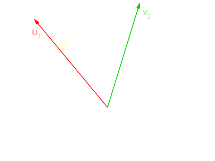
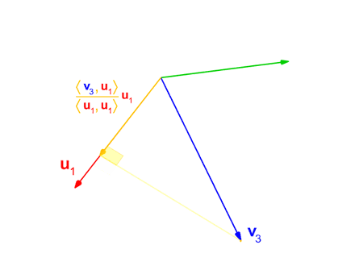
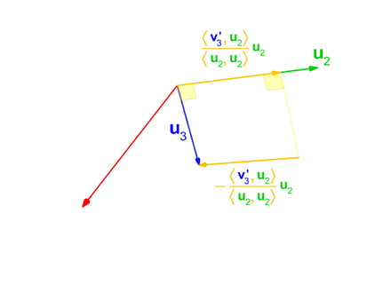
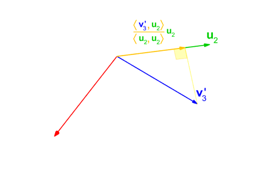

# Introduction to Linear Equation

In many applications we have a system of equations
<!--
```math
SE = \frac{\sigma}{\sqrt{n}}
```
-->
 


<br>
<br>

Which can be written as a single matrix equation:

 
<br>
<br>
Or:
<br>
<br>
 
<br>
<br>

## Solution set 

A linear system may behave in any one of three possible ways:

- The system has infinitely many solutions.
- The system has a single unique solution.
- The system has no solution.


The answer of a linear system is determined by the relationship between the number of equations and the number of unknowns.

## Underdetermined System
a system with fewer equations than unknowns has infinitely many solutions, but it may have no solution. Such a system is known as an underdetermined system.

## Overdetermined System
A system with more equations than unknowns is called as an overdetermined system.

## Determined
A system with the same number of equations and unknowns.


Depending on what your matrices looks like, you can choose between various decompositions, and depending on whether you favor speed or accuracy.

## Homogeneous vs Non-homogeneous 
A system of linear equations is homogeneous if all of the constant terms are zero.

 

# Solving Linear Equation

Depending on what your matrices looks like, you can choose between various decompositions, and depending on whether you favor speed or accuracy.

# 1) QR Decomposition
## 1-1) Square Matrix
If   is a real square matrix, then it may be decomposed as:

 

<br>
<br>


Where where  is an orthogonal matrix, 
meaning: 

 and  is an upper triangular matrix.
Furthermore, if  is invertible, then the factorization is unique if we require the diagonal elements of   to be positive.


For complex square matrices,   is a unitary matrix, meaning 


## 1-2) Rectangular Matrix
If  where  we can factor it into  unitary matrix  and  an  upper triangular matrix . Since after  row, in  all elements are entirely zeroes, we can rewrite our equation in the following form:


where 
 is an  upper triangular matrix and  is   with orthogonal columns


## 1-3) QL, RQ and LQ Decompositions
We can define , , and  decompositions, with  being a lower triangular matrix.

## 1-4) Computing the QR Decomposition
### 1-4-1) Gram Schmidt Orthogonalization 
Gram–Schmidt process is a method for orthonormalizing a set of vectors. In this process you make every column perpendicular to it's previous columns. Lets first define the **projection operator** by


where  denotes the inner product.

Now lets imagine we have the following vectors,  


The Gram–Schmidt process has the followings steps:



<br>
<br>


<br>
<br>


<br>
<br>


<br>
<br>


<br>
<br>


<br>
<br>


Due to rounding errors, the vectors  are often not quite orthogonal, therefore, it is said that the (classical) Gram–Schmidt process is numerically unstable. This can be stabilized by a small modification, where 
Instead of computing the vector  as



<br>
<br>

<br>
<br>

<br>
<br>

<br>
<br>


 


### 1-4-2) Householder Transformations
# 2) Cholesky Decomposition
# 3) LDU Decomposition
# 4) SVD Decomposition

